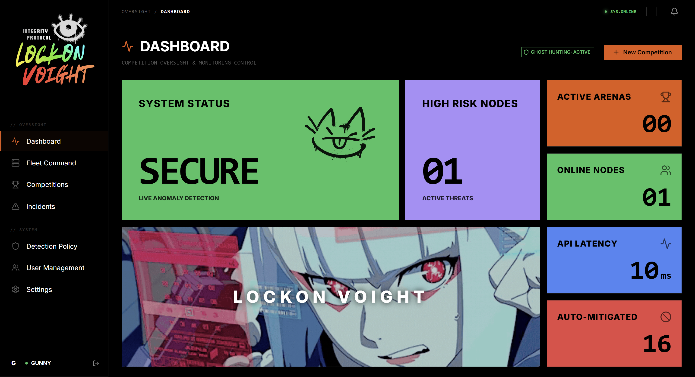
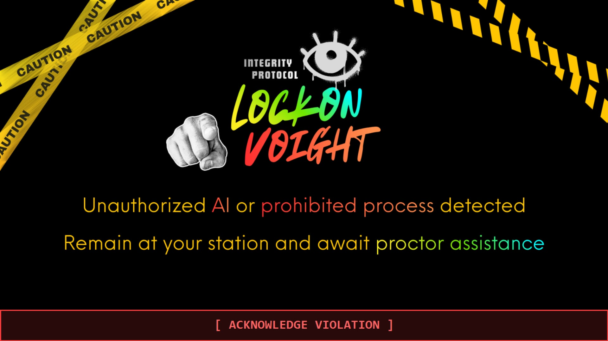

<div align="center">
  

  <h1>LOCKON VOIGHT</h1>

  <p>
    
    
    
    
    
  </p>

  <p><strong>AI Detection & Proctoring System for CTF Competitions</strong></p>
</div>

---

> *"Is this testing whether I'm a replicant or a lesbian, Mr. Deckard?"* 
> - **Blade Runner (1982)**

### The Voight-Kampff Protocol

In the cyberpunk classic *Blade Runner*, the Voight-Kampff (V-K) machine is an advanced polygraph used to distinguish synthetic Replicants (AI) from authentic humans through autonomic responses. 

**LOCKON VOIGHT** (Integrity Protocol) brings this concept into the modern cyber-warfare era. It is a real-time telemetry monitoring system designed to administer a digital "Voight-Kampff test" to connected endpoints. By analyzing process trees, local DNS profiling, and hardware resource spikes, VOIGHT distinguishes **authentic human problem-solving** from **unauthorized synthetic assistance** (e.g., ChatGPT, GitHub Copilot, local LLMs) during high-stakes cybersecurity competitions and CTF events.

</br>

<div align="center">
  
</div>

---

## Architecture

```text
┌─────────────────┐       gRPC/mTLS        ┌──────────────────┐      WebSocket     ┌────────────────────┐
│ Sentinel Node   │ ────────────────────►  │ Central Collector│ ─────────────────► │ Control Interface  │
│ (Go Agent)      │                        │ (FastAPI + gRPC) │                    │ (React + MUI)      │
│                 │                        │                  │                    │                    │
│  • Process Scan │                        │  • IoA Scoring   │                    │  • Live Grid       │
│  • Network Mon  │                        │  • Incident Mgmt │                    │  • Score Badges    │
│  • GPU/VRAM Mon │                        │  • Celery Workers│                    │  • Resource Charts │
│  • File Scanner │                        │  • Data Retention│                    │  • Incident Review │
│  • Integrity    │                        │  • JWT + RBAC    │                    │  • Fleet Command   │
│  • Watchdog     │                        │  • Rate Limiting │                    │  • Dark Tactical UI│
└─────────────────┘                        └──────────────────┘                    └────────────────────┘
         │                                          │
         │                              ┌───────────┴───────────┐
         │                              │                       │
         └──────────────────────────► PostgreSQL              Redis
                                      (TimescaleDB)       (Queue/Cache)
```

## Tech Stack

| Layer | Technology | Purpose |
|---|---|---|
| **Agent** | Go 1.22 + gopsutil | Low-overhead endpoint monitoring |
| **Server** | FastAPI + gRPC + Celery | Telemetry ingestion & scoring |
| **Dashboard** | React + MUI + Recharts | Real-time proctor interface |
| **Database** | PostgreSQL + TimescaleDB | Time-series telemetry storage |
| **Cache/Queue** | Redis 7 | Celery broker + caching |
| **Security** | mTLS (TLS 1.3) + JWT + RBAC | Agent auth + API auth + Role-based access |

## Core Features

- **Fleet Command Interface**: A centralized tactical dashboard for managing all connected Sentinel nodes, including real-time resource telemetry (CPU/RAM/GPU), network topology, and execution of administrative payloads.
- **Deep Inspection Analysis**: Raw telemetry payloads (such as intercepted process execution paths or malicious DNS correlations) are dynamically parsed and displayed as structured JSON in the Incident Review modal, allowing Proctors to make high-confidence assessments.
- **Node Identity Management**: Full CRUD capabilities for Contestant Metadata, allowing Control Operators to dynamically edit handles and team names, or safely decommission untrusted agents via the interface.
- **Tactical Screen Lock Payload**: Aggressive, full-screen visual payload that locks the contestant's screen upon detection of severe unauthorized synthetic assistance. Supports dynamic remote asset injection (`LockScreen.png`), providing a cinematic, zero-gap warning interface.
- **Live Operation Timers (T+)**: Automated mission duration tracking that synchronizes with competition states, providing a pulsing `T+ 00:00:00` display for active missions.
- **Decoupled State Management**: Zero-flash UI updates using TanStack Query and WebSocket data streams for instantaneous integrity badge updates.
- **Zero-Trust Sentinel Enrollment**: Automated token generation for agents, ensuring robust node identity mapping via hardware fingerprinting (MAC, CPU UUID).

</br>

<div align="center">
  
</div>

## Replicant Behavior Profiling (IoA Detection)

| Behavioral Anomaly (IoA) | Weight | Profiling Vector |
|---|---|---|
| Binary Tamper | 100 | SHA-256 self-hash verification |
| Heartbeat Lost | 95 | Watchdog + timeout detection |
| Local LLM (Ollama, LM Studio) | 90 | Process name + cmdline + **Absolute Path** |
| AI API (OpenAI, Anthropic) | 90 | **Local DNS Cache Profiling** + Domain matching |
| AI Agent (AutoGPT, OpenDevin) | 85 | Process detection |
| AI Editor (Cursor, Windsurf) | 80 | Process + extension scan + **Absolute Path** |
| Model File (.gguf, .safetensors) | 70 | Filesystem scan |
| VRAM Spike (>4GB sustained) | 60 | nvidia-smi monitoring |
| GPU Spike (>80% sustained) | 50 | nvidia-smi monitoring |
| Virtualization (WSL2/Docker) | 40 | Process detection (`vmmem`, `wsl.exe`) |

### Advanced Anti-Cheat Mechanisms

LOCKON VOIGHT goes beyond simple string matching. It implements several advanced countermeasures against cheating techniques often employed by Red Teams and advanced CTF participants:

1. **Defeating CDN / Reverse DNS Masking (DNS Cache Profiling)**
   - *The Threat:* APIs like `api.openai.com` are hosted behind CDNs (Cloudflare, AWS). A standard Reverse DNS lookup on the outbound IP often returns the CDN's generic domain, blinding the monitor.
   - *The Mitigation:* The Agent polls the OS's internal DNS Cache (`Get-DnsClientCache`). When an outbound connection is made to a CDN IP, the Agent instantly correlates it with the exact domain the contestant just resolved, defeating IP masking without requiring invasive packet sniffers (like Wireshark/Npcap).

2. **Thwarting Process Renaming (Absolute Path Extraction)**
   - *The Threat:* A contestant renames `cursor.exe` to `notepad.exe` to evade process monitors.
   - *The Mitigation:* VOIGHT extracts the **Absolute Executable Path** of every running process. Even if the executable is renamed, the directory structure (e.g., `AppData/Local/cursor/notepad.exe`) retains the tool's signature, triggering an immediate ESCALATE alert.

3. **Subsystem & Virtualization Fallbacks (WSL2 / Docker)**
   - *The Threat:* Contestants run local LLMs inside Windows Subsystem for Linux (WSL2) or Docker to hide the internal Linux processes from the Windows Agent.
   - *The Mitigation:* VOIGHT automatically flags `wsl.exe`, `vmmemwsl`, and `docker.exe`. Even if the internal processes are obfuscated, any AI workload will trigger the **Resource Monitor** (detecting unnatural VRAM/GPU or RAM spikes mapped to the VM).

4. **Dynamic Centralized Configurations & Policy Enforcement**
   - The Detection Policy (Blocked Domains, Processes, and File Extensions) as well as Core System Configurations (Agent Scan Intervals, Heartbeat Frequencies) are pushed dynamically from the Proctor Dashboard to all Agents via the REST API (with graceful fallback to gRPC Heartbeats if blocked), taking effect system-wide within 60 seconds without restarting the Agents.

5. **False Positive Suppression & Passive Background Filtering**
   - *The Threat:* Over-aggressive process scanning flagging dormant VPN services (`tailscaled.exe`) or Windows 11 built-in Copilot background tasks, resulting in mass false-positive lockouts.
   - *The Mitigation:* VOIGHT separates active network telemetry from passive process execution. Built-in system AI tasks and standard CTF infrastructure tools (OpenVPN, WireGuard) are excluded from the hardcoded blocklist. Detection relies on active Window Focus and DNS resolutions.

## Telemetry & Privacy Scope

LOCKON VOIGHT is designed with ethical hacking and participant privacy in mind. While the Agent monitors system activity to ensure competition integrity, it strictly limits its scope.

**What VOIGHT Collects:**
- Process names, absolute paths, and active window titles.
- Outbound DNS resolutions (domain names and IPs) to known AI infrastructure.
- System resource utilization (CPU, RAM, VRAM, and GPU Load percentages).
- System hardware fingerprints (MAC Address, CPU UUID) for Agent registration.

**What VOIGHT DOES NOT Collect:**
- **No Keylogging:** Keystrokes or input events are never captured.
- **No File Content Scanning:** Files are scanned for extensions and sizes, but source code or personal file contents are never read or transmitted.
- **No Packet Sniffing:** We do not perform Deep Packet Inspection (DPI) or intercept SSL/TLS payloads.
- **No Screen Recording:** The agent does not capture screenshots of the contestant's workspace.

## Security & Threat Model

While LOCKON VOIGHT employs advanced telemetry techniques, we maintain absolute technical transparency regarding its threat model:

- **User-Space Operation:** The Agent operates entirely in user-space (Ring 3). Unlike kernel-level anti-cheat drivers (e.g., Vanguard, BattlEye), VOIGHT does not require invasive OS-level hooks. As a result, it can theoretically be bypassed by sophisticated Ring 0 rootkits or hypervisor-level obfuscation.
- **Proctor-in-the-Loop Philosophy:** VOIGHT is engineered to be an *alerting mechanism*, not an automated judge. The system calculates Integrity Scores and triggers visual payloads, but the ultimate decision to disqualify a participant rests entirely on the human Control Operator (Proctor) reviewing the accumulated telemetry.
- **Fail-Secure Architecture:** If the Agent is forcefully terminated, the Watchdog process will attempt to restart it. If the entire network is isolated, the backend automatically flags the node as `HEARTBEAT_LOST` (IoA Weight: 95), instantly alerting the Proctor to a potential evasion attempt.

### API Security Architecture

All API endpoints are protected with a layered security model:

| Protection Layer | Scope | Mechanism |
|---|---|---|
| **JWT Authentication** | All Dashboard API endpoints | Bearer token via `HTTPBearer` |
| **Role-Based Access (RBAC)** | Destructive operations (delete, user mgmt) | `require_admin` dependency |
| **Contestant Validation** | All Telemetry ingestion endpoints | `contestant_id` existence check |
| **WebSocket Authentication** | Real-time data feeds | JWT token via query parameter (enforced in production) |
| **Login Rate Limiting** | `/api/auth/login` | 5 attempts per IP per 60 seconds |
| **File Upload Validation** | Banner uploads | Allowed types: `png, jpg, jpeg, gif, webp` - Max size: 10MB |
| **JWT Startup Guard** | Server boot | Refuses to start in production with default secret key |
| **CORS Restriction** | Cross-origin requests | Explicit origin allowlist (no wildcards in production) |
| **Public Endpoint Isolation** | Agent Download page | Only `competitionKey` exposed via `/api/settings/public` |

## System Requirements

**Proctor Server (Backend & Database)**
Server requirements scale heavily based on the number of concurrent Agents connected, as each Agent streams high-frequency telemetry (Heartbeats, Process Lists, Network Dumps).

| Deployment Scale | CPU | RAM | Storage | Notes |
|---|---|---|---|---|
| **Small** (1-50 Agents) | 4 Cores | 8 GB | 50GB SSD | Standard lab or local CTF. |
| **Medium** (50-250 Agents) | 8 Cores | 16 GB | 100GB NVMe | Regional CTFs. TimescaleDB requires extra RAM for chunking. |
| **Large** (250-1000+ Agents) | 16+ Cores | 32 GB+ | 250GB+ NVMe | National/Global events. Requires Redis/Postgres tuning. |

- **OS:** Linux (Ubuntu 22.04 LTS recommended) or Windows (via Docker Desktop)
- **Dependencies:** Docker Engine, Docker Compose

**Contestant Agent**
- **OS:** Windows 10/11, Ubuntu 20.04+, macOS (Intel & Apple Silicon)
- **Privileges:** Administrator / root (Required for accurate network and process scanning)
- **Footprint:** < 50MB RAM, < 1% CPU utilization

### Agent Capability Matrix (Cross-Platform)

Due to deep structural differences in operating systems (and security sandboxing), some of VOIGHT's advanced telemetry and offensive features are currently optimized for Windows, with Linux and macOS parity actively in development.

| Feature / Telemetry | Windows | Linux | macOS | Notes |
|---|:---:|:---:|:---:|---|
| **Heartbeat & System Metrics** | 🟢 Native | 🟢 Native | 🟢 Native | CPU, RAM, Uptime syncing |
| **Process Tracking (Basic)** | 🟢 Native | 🟢 Native | 🟢 Native | Process name, PID, basic command-line |
| **Absolute Path Extraction** | 🟢 Native | 🟢 Native | 🟡 Limited | Used to defeat process renaming tricks |
| **Local DNS Cache Extraction** | 🟢 PowerShell | 🟡 systemd | ❌ Planned | Core defense against IP/CDN masking |
| **GPU / VRAM Monitoring** | 🟢 nvidia-smi | 🟢 nvidia-smi | ❌ Metal WIP | Used to detect local LLMs running on GPU |
| **Tactical Screen Lock** | 🟢 WinForms | 🟡 X11/Wayland | ❌ Swift WIP | Aggressive full-screen visual payload |
| **Tamper & Watchdog Protect**| 🟢 Registry | 🟢 systemd | 🟡 launchd | Restarts agent if forcefully closed |
| **Dynamic Config Sync** | 🟢 Native | 🟢 Native | 🟢 Native | Real-time interval updates from Dashboard |

*(Legend: 🟢 Fully Supported & Tested \| 🟡 Partial/WIP \| ❌ Planned for Future Release)*

### Firewall Rules (Security Groups)

If deploying the Proctor Server to a cloud environment (e.g., AWS EC2, DigitalOcean), ensure your Cloud Firewall strictly follows these rules:

| Port | Protocol | Service | Source IP Allowance |
|---|---|---|---|
| `80` / `443` | TCP | Nginx (Dashboard + API Proxy) | Contestant Subnets / 0.0.0.0 |
| `8000` | TCP | FastAPI (REST API) | Internal / Nginx reverse proxy only |
| `50052` | TCP | gRPC (Telemetry Stream) | Contestant Subnets / 0.0.0.0 |
| `5173` | TCP | Vite Dev Server (Development ONLY) | **Control Operator/Admin IPs ONLY** |
| `5432` | TCP | PostgreSQL | Internal Docker Network (`localhost` only) |
| `6379` | TCP | Redis | Internal Docker Network (`localhost` only) |

> **Note:** In production, all traffic flows through Nginx on port 80/443. The Dashboard, API (`/api/`), WebSocket (`/ws/`), uploads (`/uploads/`), and static files (`/static/`) are all reverse-proxied through Nginx. Ports 8000 and 5173 should NOT be exposed externally.

## Quick Start

### Prerequisites
Before running the system locally, ensure you have the following software installed on your Proctor/Development machine:
- **Docker Desktop** (Required for PostgreSQL & Redis)
- **Python 3.12+** (For the backend server)
- **Node.js 18+ & npm** (For the React dashboard)
- **Go 1.22+** (Required by `rebuild.ps1` to compile the agent binaries)

### Step 1: Initial Setup
Clone the repository and install the required dependencies for the backend and frontend. You only need to do this once.

```powershell
# 1. Setup Python Virtual Environment & Install Backend Dependencies
cd server
python -m venv venv
.\venv\Scripts\activate
pip install -r requirements.txt
cd ..

# 2. Install Frontend Dependencies
cd dashboard
npm install
cd ..
```

### Step 2: Environment Configuration
Configure your environment secrets. **This is mandatory for security.**

```powershell
# Generate a strong JWT secret
python -c "import secrets; print(secrets.token_urlsafe(64))"
```

Edit `server/.env` and set your credentials:
```ini
# Database (use a strong, unique password)
DATABASE_URL=postgresql+asyncpg://voight:<STRONG_PASSWORD>@localhost:5432/voight_db

# JWT (paste the generated secret here)
JWT_SECRET_KEY=<YOUR_GENERATED_SECRET>

# CORS (add your production domain when deploying)
CORS_ORIGINS=["http://localhost:5173","http://localhost:3000"]
```

> **⚠️ Security:** The server will **refuse to start** in production mode if `JWT_SECRET_KEY` is still set to the default value. Always generate a unique secret before deploying.

### Step 3: Run the Startup Script
Open PowerShell as Administrator in the project folder and run:
```powershell
.\start-dev.ps1
```
*This script will automatically compile Agents, start the Database (Docker), run Migrations, launch the Server/Dashboard, and open your web browser.*

### Step 4: Accessing the Dashboard
Once the services start, the Dashboard will open at `http://localhost:5173`.
*Note: To access the dashboard from another machine on the same network, use `http://<YOUR_SERVER_IP>:5173`.*

- The system will detect it's a fresh installation and redirect you to the **INITIAL SETUP** page.
- Enter your desired **Username** and **Password** to create the Admin/Proctor account.
- Login and start monitoring!

### Step 5: Agent Download (For Contestants)
Contestants can download the Agent directly from the Dashboard without needing to log in:
1. Navigate to `http://<YOUR_SERVER_IP>:5173/download`
2. Select the appropriate platform (Windows / Linux / macOS)
3. Click **DOWNLOAD BUNDLE** - the ZIP is automatically packaged with the server's `competition_key` and IP address
4. Extract, edit `config.json` to set `team_name`, and run with Administrator/root privileges

### Step 6: Building & Customizing the Agent (For Developers)
If you modify the Go source code in the `agent/` directory or want to customize the Agent's `.exe` icon, you can recompile the binaries.

1. **Customizing the Windows Icon:**
   To set a custom `.exe` icon for Windows, ensure you have `go-winres` installed:
   ```powershell
   go install github.com/tc-hib/go-winres@latest
   ```
   Replace `agent/winres/icon.png` with your custom logo (must be exactly 256x256), then run:
   ```powershell
   cd agent
   go-winres make
   Move-Item -Force rsrc_windows_amd64.syso cmd/voight/
   ```
   This generates the necessary `.syso` resource file for the Go compiler to embed the icon.

2. **Automated Compilation & Packaging:**
   Run the rebuild script from the root directory:
   ```powershell
   .\rebuild.ps1
   ```
   *(If `make` or the script fails, you can compile manually: `$env:GOOS="windows"; $env:GOARCH="amd64"; go build -ldflags="-s -w" -o bin/voight-sentinel.exe ./cmd/voight`)*

3. **What the Script Does:**
   - Cleans up old binaries and ZIP bundles.
   - Cross-compiles the Go Agent for **Windows**, **Linux**, and **macOS**.
   - Packages the executables alongside a clean `config.json` into distribution ZIPs.
   - Copies the final bundles directly into `dashboard/public/downloads/` where they are immediately served to users.

*Note: The `.\start-dev.ps1` script automatically calls `rebuild.ps1` on startup, ensuring you are always testing the latest agent build.*

## Production Deployment

For production environments, use the Docker Compose production configuration:

```powershell
# 1. Copy and configure production environment variables
cd deploy
copy .env.example .env
# Edit .env with strong passwords and secrets

# 2. Deploy the full stack
docker compose -f docker-compose.prod.yml up -d
```

The production stack includes:
- **Nginx** reverse proxy (port 80) with security headers and gzip
- **FastAPI** API server (4 Uvicorn workers)
- **Celery Worker** + **Celery Beat** for background tasks
- **PostgreSQL + TimescaleDB** with resource limits
- **Redis** with password authentication

All services run with health checks and automatic restarts. The API server runs as a non-root user (`voight`) inside the container.

## Development & Contributing

We welcome contributions to expand VOIGHT's detection capabilities:
- **Backend (Python):** Follow `PEP-8` guidelines. Use `black` for formatting and `flake8` for linting.
- **Agent (Go):** Use standard `gofmt`. Ensure all new OS-specific syscalls are separated using build tags (e.g., `_windows.go`, `_unix.go`).
- **Dashboard (React):** Use `ESLint` and Prettier to maintain UI consistency.

## Future Roadmap

- [ ] **eBPF Integration (Linux):** Shift process and network monitoring to the kernel level using eBPF for zero-overhead, tamper-proof telemetry.
- [ ] **Memory Forensics:** Deep RAM scanning to detect pre-loaded model weights (e.g., GGML/GGUF tensors) residing in memory without active execution.
- [ ] **Offline Payload Execution:** Allow the Agent to trigger the Tactical Screen Lock autonomously if a network isolation attack is detected for more than 30 seconds.
- [ ] **Linux DNS Cache Profiling:** Implement reliable DNS cache extraction on Linux via `systemd-resolved` / `nscd` / `dnsmasq` log parsing to achieve full parity with the Windows `Get-DnsClientCache` approach.
- [ ] **Linux Screen Lock (X11/Wayland):** Port the Tactical Screen Lock payload to Linux desktops using GTK/Qt overlays with X11 and Wayland compositor support.
- [ ] **macOS Complete Parity:** Expand the Darwin agent to achieve full feature parity - including DNS cache extraction, GPU monitoring via Metal Performance Shaders, native Screen Lock (Swift/AppKit), and robust `launchd`-based Watchdog protection.
- [ ] **Agent GUI Interface:** Build a native graphical interface for the Sentinel Agent, providing contestants with a visible system tray / status panel showing connection health, enrollment status, and real-time heartbeat indicators - replacing the current headless CLI-only operation.

## Frequently Asked Questions (FAQ)

**Q: Does VOIGHT cause network lag or CPU spikes during a CTF?**  
**A:** No. The Agent is written in Go and designed for minimal overhead (< 1% CPU). Telemetry is batched, compressed, and transmitted via gRPC, requiring negligible bandwidth even when scaled to 500+ agents.

**Q: Why not use commercial MDM (Mobile Device Management) or Game Anti-Cheats?**  
**A:** MDMs lack the specific heuristics required to detect modern AI developer tools (e.g., local Ollama models, Cursor IDE extensions). Game Anti-Cheats are typically Ring-0 (kernel level), which is overly invasive and difficult to deploy safely in BYOD (Bring Your Own Device) environments.

**Q: What happens if a contestant accidentally visits a blocked domain?**  
**A:** The system does not immediately lock the screen. It accumulates an "IoA Score" (Indicator of Attack). The human Control Operator receives an alert on the Dashboard and makes the final decision on whether to issue a Tactical Screen Lock.

## Acknowledgments

This project stands on the shoulders of several incredible open-source projects:

**Agent (Go):**
- [**gopsutil**](https://github.com/shirou/gopsutil) for low-level OS metric collection.
- [**go-winres**](https://github.com/tc-hib/go-winres) for embedding custom branding resources into Go binaries.

**Server (Python):**
- [**FastAPI**](https://fastapi.tiangolo.com/) for lightning-fast async backend routing.
- [**SQLAlchemy**](https://www.sqlalchemy.org/) & [**Alembic**](https://alembic.sqlalchemy.org/) for async ORM and database migrations.
- [**Celery**](https://docs.celeryq.dev/) for distributed background task processing.
- [**gRPC**](https://grpc.io/) & [**Protocol Buffers**](https://protobuf.dev/) for high-performance remote procedure calls.
- [**TimescaleDB**](https://www.timescale.com/) for handling high-frequency telemetry storage.
- [**Redis**](https://redis.io/) for Celery task brokering and high-speed caching.

**Dashboard (React):**
- [**React**](https://react.dev/) as the core UI framework.
- [**Vite**](https://vite.dev/) for lightning-fast development builds and HMR.
- [**Material UI (MUI)**](https://mui.com/) for the component library and tactical dark theme.
- [**React Router**](https://reactrouter.com/) for client-side SPA navigation.
- [**TanStack Query**](https://tanstack.com/query) for zero-flash decoupled state management.
- [**Axios**](https://axios-http.com/) for HTTP API communication.
- [**Recharts**](https://recharts.org/) for real-time resource and telemetry charting.
- [**Lucide React**](https://lucide.dev/) for crisp, consistent iconography.

## Documentation

- [Deployment Guide](docs/deployment-guide.md) - Setup, config, and troubleshooting
- [Proctor User Guide](docs/proctor-guide.md) - How to use the Dashboard
- [Scoring Algorithm](docs/scoring-algorithm.md) - IoA weights and decay formula
- [Privacy Policy](docs/privacy-policy.md) - PDPA/GDPR compliance
- **Interactive API Docs (Swagger UI)** - Available at `http://localhost:8000/docs` during development. Automatically hidden when `ENVIRONMENT=production`.

## Project Structure

```
LOCKON-VOIGHT/
├── agent/                  # Go Agent (The Sentinel)
│   ├── cmd/voight/         # Main entry point
│   ├── cmd/watchdog/       # Watchdog binary
│   ├── internal/           # Config, monitors, gRPC client, integrity
│   └── winres/             # Windows resource branding (icon, manifest)
├── server/                 # FastAPI Server (The Core)
│   ├── app/api/            # REST endpoints (auth, settings, policy, etc.)
│   ├── app/core/           # Config, security, database
│   ├── app/scoring/        # IoA Scoring Engine
│   ├── app/grpc/           # gRPC server (telemetry + enrollment)
│   ├── app/tasks/          # Celery workers
│   └── app/ws/             # WebSocket endpoints
├── dashboard/              # React Dashboard (The Oversight)
│   ├── src/pages/          # Dashboard, Incidents, Fleet, Policy, etc.
│   ├── src/services/       # API client, WebSocket hook
│   └── nginx.conf          # Production reverse proxy config
├── proto/                  # Protobuf definitions
├── deploy/                 # Docker Compose (dev + prod) & scripts
├── images/                 # System preview screenshots
├── tests/                  # Load, detection, security tests
└── docs/                   # Documentation
```

Proprietary - LOCKON Project. All rights reserved.
