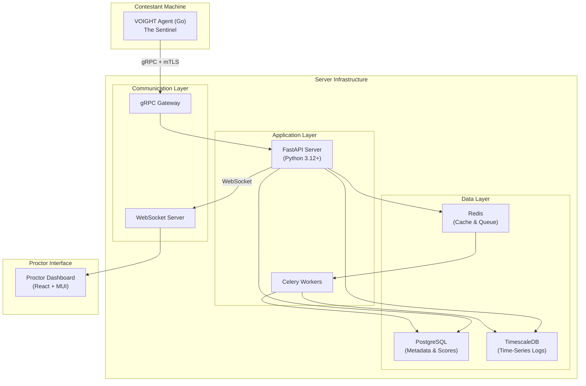
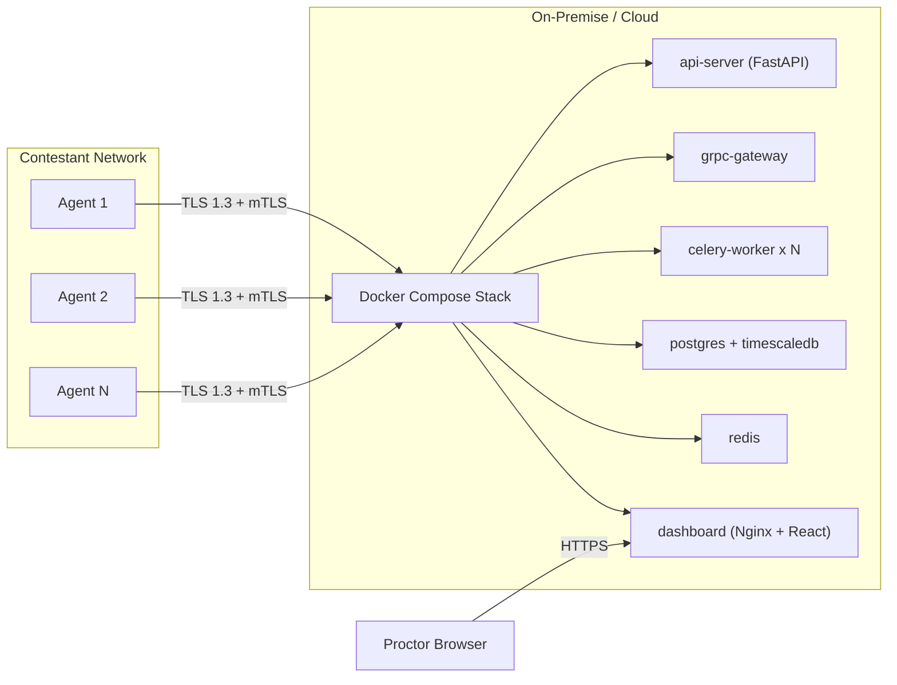
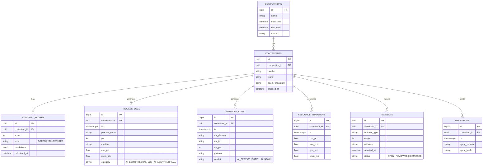
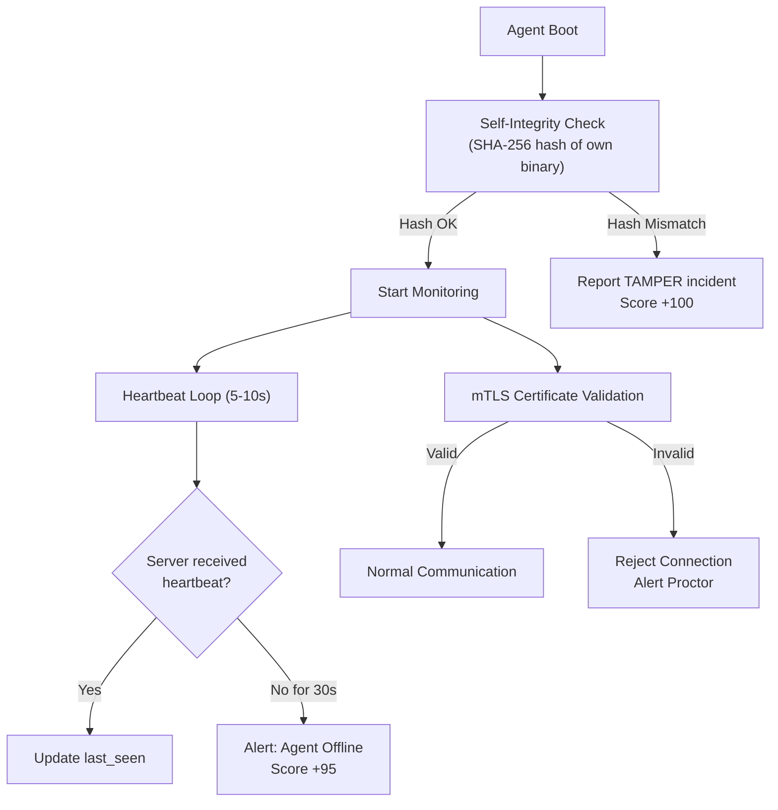
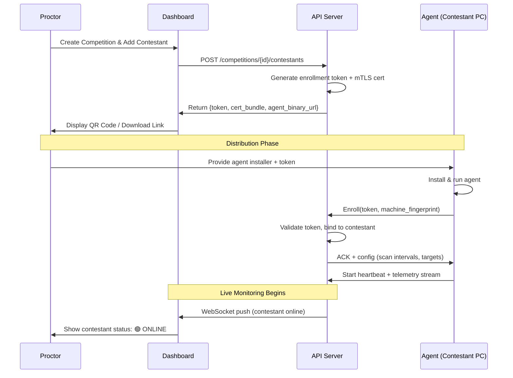
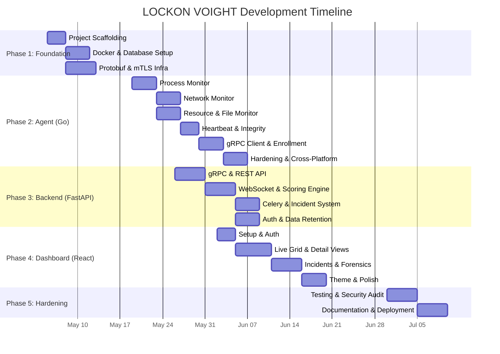

# LOCKON VOIGHT: Implementation Plan

> **Verification of Operational Integrity & Ghost Hunting Tool**
> AI Detection & Proctoring System for CTF Competitions

---

## 1. System Architecture



### Deployment Topology



---

## 2. Database Schema



> [!NOTE]
> `PROCESS_LOGS`, `NETWORK_LOGS`, `RESOURCE_SNAPSHOTS`, `HEARTBEATS` → เก็บใน **TimescaleDB Hypertable** (partitioned by time)
> ที่เหลือเก็บใน **PostgreSQL** ปกติ

---

## 3. Integrity Scoring Algorithm

### IoA Weight Table

| Indicator | Category | Weight | Severity |
|---|---|---|---|
| `cursor`, `windsurf`, `zed` process detected | AI_EDITOR | **80** | 🔴 High |
| `ollama`, `lm-studio`, `vllm` process detected | LOCAL_LLM | **90** | 🔴 Critical |
| `autogpt`, `opendevin` process detected | AI_AGENT | **85** | 🔴 Critical |
| DNS/HTTPS → `api.openai.com` | NETWORK | **90** | 🔴 Critical |
| DNS/HTTPS → `api.anthropic.com` | NETWORK | **90** | 🔴 Critical |
| DNS/HTTPS → `generativelanguage.googleapis.com` | NETWORK | **85** | 🔴 High |
| DNS/HTTPS → `api.deepseek.com` | NETWORK | **85** | 🔴 High |
| GPU usage > 80% sustained > 30s | RESOURCE | **50** | 🟡 Medium |
| VRAM > 4GB sustained > 60s | RESOURCE | **60** | 🟡 Medium |
| Large model files detected (`.gguf`, `.safetensors`) | FILE_SCAN | **70** | 🔴 High |
| Suspicious browser extension (AI-related) | BROWSER | **65** | 🟡 Medium |
| Proxy/VPN connection detected | EVASION | **40** | 🟡 Medium |
| Agent heartbeat missed > 30s | TAMPER | **95** | 🔴 Critical |
| Agent binary hash mismatch | TAMPER | **100** | 🔴 Critical |

### Scoring Formula

```
Raw Score = Σ (indicator_weight × decay_factor)

decay_factor = 1.0          (if detected within last 5 min)
             = 0.7          (if detected 5-15 min ago)
             = 0.4          (if detected 15-30 min ago)
             = 0.1          (if detected > 30 min ago)

Final Score = min(Raw Score, 100)
```

### Thresholds

| Level | Score Range | Dashboard Color | Action |
|---|---|---|---|
| **GREEN** | 0 – 29 | 🟢 | No action needed |
| **YELLOW** | 30 – 69 | 🟡 | Flag for review, proctor notified |
| **RED** | 70 – 100 | 🔴 | Incident alert, immediate review required |

---

## 4. Anti-Tamper Strategy



### Layers of Protection

| Layer | Technique | Purpose |
|---|---|---|
| **L1: Binary** | Go binary obfuscation (`garble`) | Prevent reverse engineering |
| **L2: Runtime** | Self-hash verification at startup + periodic | Detect binary tampering |
| **L3: Network** | Mutual TLS (mTLS) with per-agent certificates | Prevent fake agents |
| **L4: Heartbeat** | 5-10s interval check-in | Detect agent kill/block |
| **L5: Watchdog** | Secondary lightweight process monitors primary | Detect process termination |

---

## 5. Agent Enrollment Flow



---

## 6. Privacy & Data Collection Policy Framework

> [!IMPORTANT]
> ต้องจัดทำเอกสารนี้ให้ครบถ้วนก่อนนำไปใช้จริง เพื่อให้สอดคล้องกับ PDPA / GDPR

### Data Collection Manifest

| Data Type | Collected | Retention | Purpose |
|---|---|---|---|
| Process list (name, PID, CPU/MEM) | ✅ | Competition + 30 days | AI process detection |
| DNS queries & destination IPs | ✅ | Competition + 30 days | AI service detection |
| CPU/GPU/RAM usage metrics | ✅ | Competition + 30 days | Resource anomaly detection |
| Keystroke content | ❌ **Never** | — | — |
| Screen capture | ❌ **Never** | — | — |
| File content | ❌ **Never** | — | — |
| File names (model files only) | ✅ (targeted scan) | Competition + 7 days | Local LLM detection |

### Required Consent

- ผู้แข่งต้อง **ยินยอมเป็นลายลักษณ์อักษร** ก่อนติดตั้ง Agent
- Agent แสดง **System Tray Icon** ตลอดเวลาที่ทำงาน (ไม่ซ่อน)
- ผู้แข่งสามารถ **ขอดูข้อมูลที่ถูกเก็บ** ได้หลังจบการแข่งขัน
- ข้อมูลถูก **ลบอัตโนมัติ** ตาม retention policy

---

## 7. Implementation Phases

### Phase 1: Foundation & Infrastructure (Week 1-2)

> ตั้ง Infrastructure พื้นฐาน, Database, และ Project Structure

| # | Task | Detail | Acceptance Criteria |
|---|---|---|---|
| 1.1 | Project Scaffolding | สร้าง Monorepo structure: `/agent`, `/server`, `/dashboard`, `/proto`, `/deploy` | Directory structure พร้อม README |
| 1.2 | Docker Compose Setup | PostgreSQL + TimescaleDB + Redis containers | `docker compose up` ทำงานได้ |
| 1.3 | Database Migration | สร้าง Schema ตาม ERD ด้วย Alembic | Tables + Hypertables สร้างสำเร็จ |
| 1.4 | Protobuf Definition | กำหนด `.proto` files สำหรับ Agent↔Server communication | Compile `.proto` → Go + Python stubs |
| 1.5 | mTLS Certificate Infrastructure | สร้าง CA + script สำหรับ generate per-agent certs | Agent cert generation ทำงานได้ |

### Phase 2: VOIGHT Agent — The Sentinel (Week 3-5)

> พัฒนา Agent ด้วย Go ที่ทำงานบนเครื่องผู้แข่ง

| # | Task | Detail | Acceptance Criteria |
|---|---|---|---|
| 2.1 | Process Monitor Module | Scan running processes, classify AI vs Normal | ตรวจพบ `cursor`, `ollama` ฯลฯ ได้ถูกต้อง |
| 2.2 | Network Monitor Module | Capture DNS queries + outbound connections | ตรวจจับ `api.openai.com` connections ได้ |
| 2.3 | Resource Monitor Module | CPU/GPU/RAM/VRAM sampling ทุก 5 วินาที | ส่ง metrics ได้ถูกต้อง, GPU spike detected |
| 2.4 | File Scanner Module | Scan for `.gguf`, `.safetensors`, `.bin` (large) | พบไฟล์ LLM model ได้ |
| 2.5 | Heartbeat & Self-Integrity | Periodic check-in + binary self-hash | Heartbeat ทุก 5-10s, tamper detection works |
| 2.6 | gRPC Client | ส่ง telemetry ไป Server ผ่าน gRPC + mTLS | Data ถึง Server ถูกต้อง |
| 2.7 | Enrollment Flow | รับ token, register กับ server, ได้ config กลับมา | Agent enroll สำเร็จ, ปรากฏบน Dashboard |
| 2.8 | Binary Hardening | Obfuscation ด้วย `garble`, UPX compression | Binary ขนาดเล็ก, decompile ยาก |
| 2.9 | Watchdog Process | Secondary process monitors primary agent | Agent ถูก kill → Watchdog แจ้งเตือน |
| 2.10 | Cross-Platform Build | Build สำหรับ Windows + Linux | Binary ทำงานได้ทั้ง 2 OS |

### Phase 3: Central Collector API — The Core (Week 4-6)

> พัฒนา Backend ด้วย FastAPI สำหรับรับ, ประมวลผล, และวิเคราะห์ข้อมูล

| # | Task | Detail | Acceptance Criteria |
|---|---|---|---|
| 3.1 | gRPC Server | รับ telemetry จาก Agents | รับข้อมูลจาก 100+ agents พร้อมกันได้ |
| 3.2 | REST API | CRUD endpoints สำหรับ Dashboard | Swagger docs ครบ, ทุก endpoint ทำงานได้ |
| 3.3 | WebSocket Server | Push real-time updates ไป Dashboard | Dashboard รับ update ภายใน 1 วินาที |
| 3.4 | IoA Scoring Engine | Implement scoring algorithm + weight table | คำนวณ score ถูกต้องตาม formula |
| 3.5 | Celery Workers | Background tasks: log analysis, scoring | Async scoring ทำงานไม่ block API |
| 3.6 | Incident Generator | สร้าง Incident alerts เมื่อ score ถึง threshold | Incident ถูกสร้างและ push ไป Dashboard |
| 3.7 | Competition Management API | CRUD competitions, contestants, enrollment tokens | จัดการแข่งขันได้ครบ lifecycle |
| 3.8 | JWT Authentication | Auth สำหรับ Proctor login + API access | Login, token refresh, role-based access |
| 3.9 | Data Retention Service | Auto-delete data ตาม retention policy | ข้อมูลเกินกำหนดถูกลบอัตโนมัติ |

### Phase 4: Proctor Dashboard — The Oversight (Week 5-8)

> พัฒนา Dashboard ด้วย React + MUI สำหรับกรรมการ

| # | Task | Detail | Acceptance Criteria |
|---|---|---|---|
| 4.1 | Project Setup | Vite + React + MUI + TanStack Query | Dev server ทำงานได้ |
| 4.2 | Auth & Login Page | JWT login flow สำหรับ Proctor | Login/Logout ทำงานได้ |
| 4.3 | Competition Overview | หน้ารวมแสดงการแข่งขันทั้งหมด | สร้าง/แก้ไข/ดูแข่งขันได้ |
| 4.4 | Live Contestant Grid | แสดงผู้แข่งทุกคนพร้อม Integrity Score สี | Real-time score update ผ่าน WebSocket |
| 4.5 | Contestant Detail View | Deep-dive: Process list, Network logs, Resource charts | กราฟ CPU/GPU (Recharts) แสดงถูกต้อง |
| 4.6 | Incident Panel | รายการ Alerts พร้อม Review/Dismiss actions | Proctor review incident ได้ |
| 4.7 | Snapshot & Forensic View | ดู Timeline ย้อนหลังของ contestant | เลื่อน timeline ดูข้อมูลย้อนหลังได้ |
| 4.8 | Enrollment Manager | Generate tokens, QR codes, download agent | สร้าง enrollment package ได้ |
| 4.9 | Dark Tactical Theme | MUI theme customization — Soft Tech aesthetic | UI สวย, สอดคล้องกับ LOCKON brand |
| 4.10 | Responsive Layout | รองรับ Desktop + Tablet | ใช้งานบน iPad ได้ |

### Phase 5: Hardening & Polish (Week 8-10)

> Security hardening, Testing, Documentation, และ Deployment

| # | Task | Detail | Acceptance Criteria |
|---|---|---|---|
| 5.1 | Load Testing | ทดสอบ 500+ concurrent agents | API ไม่ล่ม, latency < 500ms |
| 5.2 | Detection Accuracy Testing | ทดสอบกับ AI tools จริง (Cursor, ChatGPT, Ollama) | Detection rate > 95% |
| 5.3 | Anti-Tamper Testing | ทดสอบ kill agent, modify binary, fake agent | ทุก scenario ถูกตรวจจับ |
| 5.4 | Evasion Testing | ทดสอบ VPN/Proxy bypass, renamed processes | ตรวจจับ evasion ได้ > 80% |
| 5.5 | Privacy Compliance Review | ตรวจสอบ data collection ตาม PDPA | ไม่เก็บข้อมูลที่ไม่ได้ระบุ |
| 5.6 | Production Docker Setup | Optimized multi-stage builds, health checks | One-command deployment works |
| 5.7 | Deployment Documentation | Setup guide, config reference, troubleshooting | ผู้ใช้ใหม่ deploy ได้ภายใน 30 นาที |
| 5.8 | User Guide for Proctors | วิธีใช้ Dashboard, วิธีอ่าน Score, วิธี Review | เอกสารครบถ้วน |

---

## 8. Testing Strategy

### Detection Test Matrix

| Test Case | Tool/Method | Expected Result |
|---|---|---|
| Open Cursor IDE | Process monitor | Score +80, YELLOW/RED |
| Query ChatGPT in browser | Network monitor (DNS) | Score +90, RED |
| Run Ollama locally | Process + GPU monitor | Score +90, RED |
| Use VPN to hide traffic | Network anomaly | Score +40, flagged |
| Kill agent process | Heartbeat + Watchdog | Score +95, RED alert |
| Rename `ollama` → `myapp` | Command-line arg analysis + file hash | Detected via signature |
| Use AI browser extension | Browser extension scan | Score +65, YELLOW |

### Performance Benchmarks

| Metric | Target |
|---|---|
| Agent RAM usage | < 30 MB |
| Agent CPU usage (idle) | < 1% |
| Heartbeat round-trip | < 100ms (LAN) |
| Dashboard update latency | < 1 second |
| Concurrent agents supported | 500+ |
| Telemetry ingestion rate | 10,000 events/sec |

---

## 9. Project Structure

```
LOCKON-VOIGHT/
├── agent/                     # Go Agent (The Sentinel)
│   ├── cmd/
│   │   └── voight/main.go
│   ├── internal/
│   │   ├── monitor/           # Process, Network, Resource, File scanners
│   │   ├── heartbeat/
│   │   ├── enrollment/
│   │   ├── grpc/
│   │   └── integrity/         # Self-hash verification
│   ├── go.mod
│   └── Makefile
├── server/                    # FastAPI Backend (The Core)
│   ├── app/
│   │   ├── api/               # REST endpoints
│   │   ├── grpc/              # gRPC server
│   │   ├── ws/                # WebSocket server
│   │   ├── scoring/           # IoA Scoring Engine
│   │   ├── models/            # SQLAlchemy models
│   │   ├── services/          # Business logic
│   │   └── tasks/             # Celery workers
│   ├── alembic/               # DB migrations
│   ├── requirements.txt
│   └── Dockerfile
├── dashboard/                 # React Dashboard (The Oversight)
│   ├── src/
│   │   ├── components/
│   │   ├── pages/
│   │   ├── hooks/
│   │   ├── theme/             # MUI Dark Tactical theme
│   │   └── services/          # API & WebSocket clients
│   ├── package.json
│   └── Dockerfile
├── proto/                     # Protobuf definitions
│   └── voight/
│       ├── telemetry.proto
│       └── enrollment.proto
├── deploy/                    # Deployment configs
│   ├── docker-compose.yml
│   ├── docker-compose.prod.yml
│   └── certs/                 # mTLS certificate scripts
├── docs/                      # Documentation
│   ├── scoring-algorithm.md
│   ├── privacy-policy.md
│   ├── deployment-guide.md
│   └── proctor-manual.md
└── README.md
```

---

## 10. Timeline Summary



> [!TIP]
> Phase 2 และ 3 สามารถทำ **ขนานกัน** ได้บางส่วน เนื่องจาก Protobuf definitions ถูกกำหนดไว้แล้วตั้งแต่ Phase 1

---

## 11. Risk Register

| Risk | Impact | Likelihood | Mitigation |
|---|---|---|---|
| ผู้แข่ง reverse-engineer Agent | 🔴 High | Medium | Multi-layer obfuscation + mTLS + watchdog |
| False positive สูงเกินไป | 🟡 Medium | Medium | Tunable weight system + proctor manual review |
| Agent ทำให้เครื่องผู้แข่งช้า | 🔴 High | Low | Go low-overhead design, RAM < 30MB target |
| Local LLM ไม่มี network traffic | 🟡 Medium | High | GPU/VRAM monitoring + model file scanning |
| Legal issues จากการเก็บข้อมูล | 🔴 High | Medium | PDPA-compliant policy + explicit consent |
| Scale ไม่ไหวเมื่อ agent > 500 | 🟡 Medium | Low | Load test early, horizontal scaling with Celery |

---

## 12. Tech Stack Summary

| Component | Technology | Rationale |
|---|---|---|
| **Agent** | Go + garble + gopsutil | Single binary, low overhead, hard to reverse |
| **Agent ↔ Server** | gRPC + Protobuf + mTLS | Fast, typed, secure, bandwidth-efficient |
| **Server** | FastAPI (Python 3.12+) | Async, ML-friendly, rapid development |
| **Task Queue** | Celery + Redis | Non-blocking heavy analysis |
| **Server → Dashboard** | WebSocket | Real-time push updates |
| **Primary DB** | PostgreSQL | Structured data, ACID compliance |
| **Time-Series DB** | TimescaleDB | High-volume telemetry, efficient forensics |
| **Cache** | Redis | Agent status, temporary state |
| **Dashboard** | React (Vite) + MUI | Stable components, data-heavy UI support |
| **State Management** | TanStack Query | Efficient server-state caching |
| **Charts** | Recharts | CPU/GPU anomaly visualization |
| **Icons** | Lucide React | Consistent, modern iconography |
| **Auth** | JWT | Stateless, scalable authentication |
| **Deployment** | Docker Compose | One-command on-premise or cloud deploy |
| **Encryption** | TLS 1.3 + mTLS | End-to-end encrypted, mutual authentication |

> [!IMPORTANT]
> **Tailwind CSS** จะใช้เฉพาะ layout/spacing utilities เท่านั้น โดยให้ **MUI** เป็น component library หลักเพื่อหลีกเลี่ยง CSS specificity conflicts
